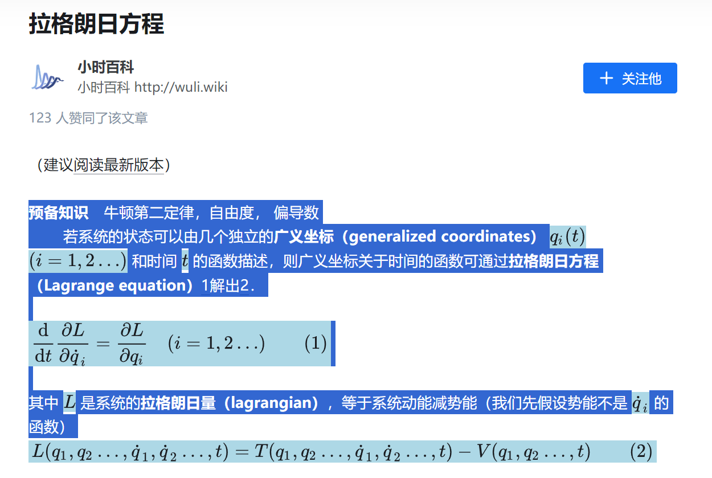

[English](./README_EN.md) | 中文

# FormulaCopier

在某些网站（比如zhihu.com）复制内容时，如果出现被渲染的LeTeX公式，那么这个公式可能无法被复制.

这个Tampermonkey脚本可以让你在这些网页上复制文本时，同时复制文本和原始LaTeX公式并为公式添加高亮。

目前在Google Chrome和Microsoft Edge上测试可用。

## v0.3更新

* 新增支持Wikipedia公式复制。
* 修复已知bug。

## 支持网页

* https://www.zhihu.com/*
* https://zhuanlan.zhihu.com/p/*
* https://\*.wikipedia.org/\*

## 功能

* **复制公式**：复制文本时LaTeX公式会与文本一起复制，使得公式复制到其他地方时格式正确。  
* **公式高亮**：选中包含LaTeX公式的文本时，公式会被高亮显示，识别是否复制文本。

## 安装

* 确保已安装[Tampermonkey](http://tampermonkey.net/)或类似的用户脚本管理器并启动。
* 点击 [安装插件](https://github.com/yuhangchen0/FormulaCopier/raw/main/FormulaCopier.user.js) 弹出油猴安装页面，点击安装即可。

## 反馈与建议

本项目使用MIT许可证。如果你在使用过程中遇到任何问题或有任何建议，欢迎在本项目的Issues提出或者发起Pull Request。

## 预览

